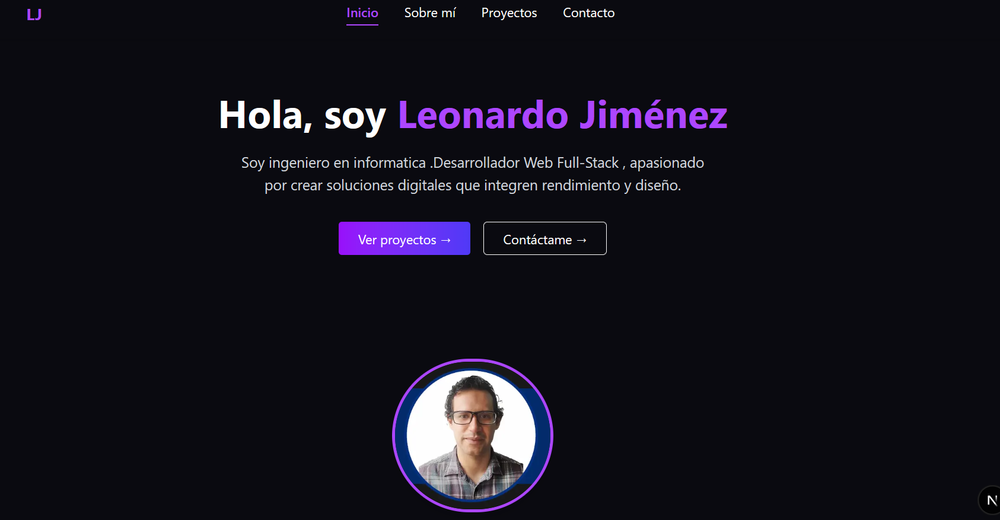

# Leonardo Jiménez – Portafolio Web

<p align="center">
  
</p>

Este es el repositorio de mi portafolio profesional como desarrollador web **Full-Stack**, creado con **Next.js** y estilizado con **TailwindCSS**.  
El sitio está diseñado para mostrar mis proyectos, experiencia y facilitar el contacto directo 🚀

---

## 🚀 Tecnologías utilizadas

- Next.js v16.0.5
- Node v20.19.6
- React v19.2.0  
- TailwindCSS v4.1.17  
- TypeScript v5  
- Framer Motion (animaciones)  
- React Icons y Heroicons  
- React PDF (visualización y descarga de CV)

---

## 📁 Estructura del sitio

### 🏠 Inicio
Presentación personal con imagen de perfil, introducción y botones de navegación.

### 👤 Sobre mí
Descripción profesional, años de experiencia calculados dinámicamente, tecnologías dominadas y botón para descargar el CV (`CV2.pdf`).

### 💼 Proyectos
Listado de proyectos con enlaces públicos a GitLab.  
Cada tarjeta incluye nombre, descripción, tecnologías utilizadas y demo/repositorio.

### 📬 Contacto
- 📧 **Correo:** leosenin.123@gmail.com  
- 📍 **Ubicación:** Caracas, Avenida principal de La Carlota  
- 📞 **Teléfono:** 0412-5546012  

---

## 🧑‍💻 Instalación local

```bash
npm install
npm run dev

